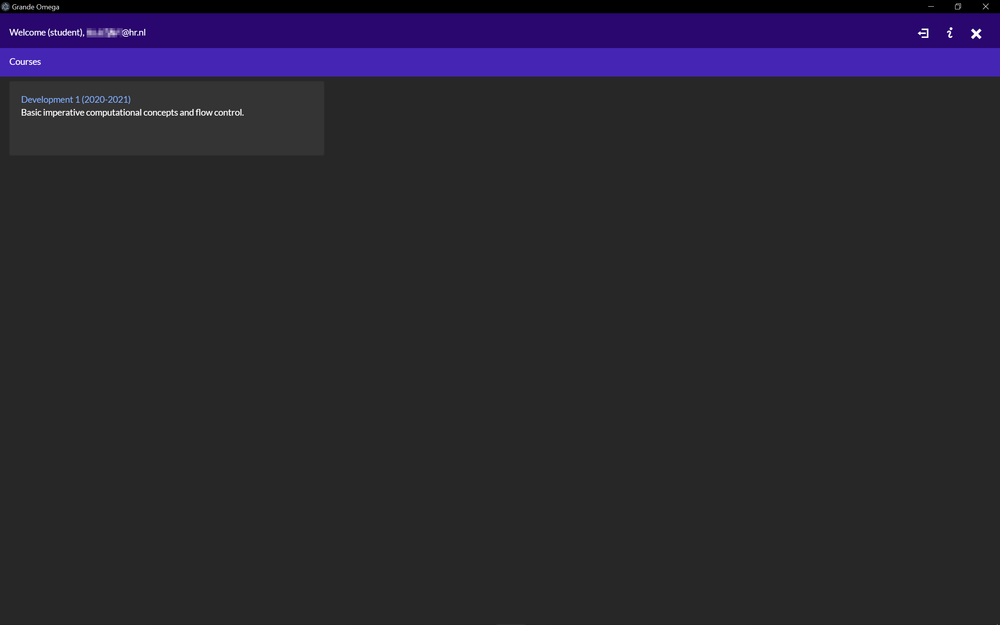
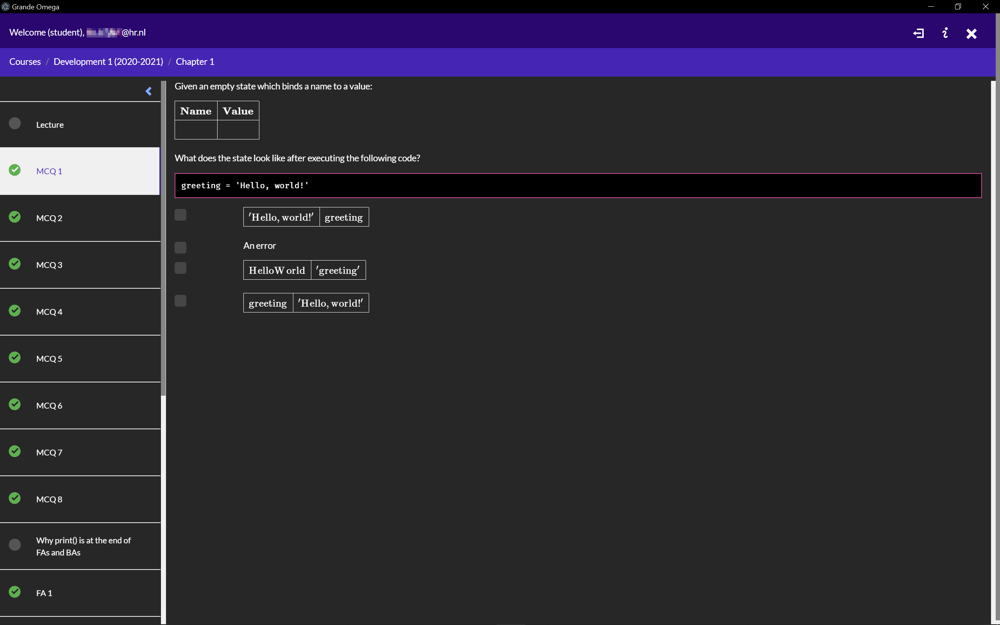
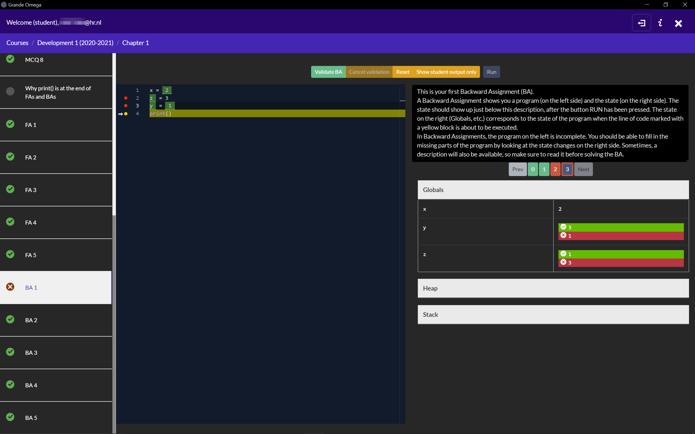

<!-- @format -->

# Fox Dark

A basic dark mode skin for Grande Omega

---

## Screenshots

---

## Skin Installation

1. Read the instruction on https://github.com/Grande-Omega-Skins/Grande-Omega-Skins#resource-folder-locations.

2. Download the latest release for this skin, see the release section on the right on the repo of that skin.

3. Extract the contents of `fox-dark/dist` on top of your resource folder.

4. Replace the files you're asked to replace. Next time you start Grande Omega it should appear in this skin.

To change skin, restore the resource folder from the copy you made and repeat the installation steps.
